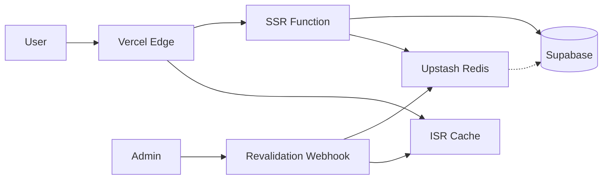

# E-commerce Frontend Development Plan (Next.js App Router)

> **Project Scale**: 50K products | 20K users | 200-400 orders/day  
> **Stack**: Next.js 16 + TailwindCSS 4 + Supabase (backend ready) + Redis (Upstash) + Cloudinary

---

## Recommended Folder Structure

```
src/
├── app/                          # Next.js App Router
│   ├── (auth)/                   # Auth route group (no layout nesting)
│   │   ├── login/
│   │   ├── register/
│   │   └── forgot-password/
│   ├── (shop)/                   # Main shop route group
│   │   ├── page.tsx              # Homepage
│   │   ├── products/
│   │   │   ├── page.tsx          # Product listing (paginated)
│   │   │   └── [slug]/
│   │   │       └── page.tsx      # Product detail
│   │   ├── categories/
│   │   │   └── [slug]/
│   │   │       └── page.tsx      # Category listing
│   │   ├── search/
│   │   │   └── page.tsx          # Search results
│   │   ├── cart/
│   │   │   └── page.tsx          # Cart page
│   │   └── checkout/
│   │       └── page.tsx          # Checkout flow
│   ├── (user)/                   # Authenticated user pages
│   │   ├── account/
│   │   │   ├── page.tsx          # Account overview
│   │   │   ├── orders/
│   │   │   ├── addresses/
│   │   │   └── wishlist/
│   │   └── orders/
│   │       └── [id]/
│   │           └── page.tsx      # Order detail
│   ├── api/                      # API routes (minimal - revalidation, webhooks)
│   │   ├── revalidate/
│   │   └── webhooks/
│   ├── layout.tsx
│   ├── loading.tsx
│   ├── error.tsx
│   ├── not-found.tsx s
│   └── globals.css
├── components/
│   ├── ui/                       # Atomic components (Button, Input, Card, Modal)
│   ├── layout/                   # Header, Footer, Sidebar, Navigation
│   ├── product/                  # ProductCard, ProductGrid, ProductQuickView
│   ├── cart/                     # CartItem, CartSummary, CartDrawer
│   ├── checkout/                 # CheckoutForm, PaymentSelector, AddressForm
│   ├── search/                   # SearchBar, SearchResults, Filters
│   ├── account/                  # OrderHistory, AddressBook, ProfileForm
│   └── common/                   # Breadcrumbs, Pagination, Skeleton, EmptyState
├── lib/
│   ├── supabase/
│   │   ├── client.ts             # Browser client
│   │   ├── server.ts             # Server client
│   │   └── middleware.ts         # Auth middleware helpers
│   ├── redis/
│   │   └── client.ts             # Upstash Redis client
│   ├── api/                      # API wrapper functions
│   │   ├── products.ts
│   │   ├── categories.ts
│   │   ├── cart.ts
│   │   ├── orders.ts
│   │   └── user.ts
│   └── utils/
│       ├── formatters.ts         # Price, date formatters
│       ├── validators.ts         # Form validation schemas
│       └── constants.ts          # App constants
├── hooks/
│   ├── useCart.ts
│   ├── useWishlist.ts
│   ├── useAuth.ts
│   ├── useDebounce.ts
│   └── useInfiniteProducts.ts
├── stores/                       # Client state (Zustand)
│   ├── cart-store.ts
│   ├── wishlist-store.ts
│   └── ui-store.ts               # Modal, drawer, toast states
├── types/
│   ├── product.ts
│   ├── order.ts
│   ├── user.ts
│   └── api.ts
└── middleware.ts                 # Auth protection, redirects
```

---

## Phase 1: MVP (Weeks 1-4)

**Goal**: Core shopping flow — users can browse, search, add to cart, and checkout

### Pages & Routes

| Route                 | Purpose                                              | Rendering                               |
| --------------------- | ---------------------------------------------------- | --------------------------------------- |
| `/`                   | Homepage with featured products, categories, banners | **ISR** (60s)                           |
| `/products`           | Paginated product listing                            | **SSR** with cursor pagination          |
| `/products/[slug]`    | Product detail page                                  | **ISR** (300s) + on-demand revalidation |
| `/categories/[slug]`  | Category product listing                             | **SSR** with cursor pagination          |
| `/search`             | Search results                                       | **Client-side** (immediate feedback)    |
| `/cart`               | Shopping cart                                        | **Client** (Zustand + localStorage)     |
| `/checkout`           | Checkout flow                                        | **Client** (protected route)            |
| `/login`, `/register` | Auth pages                                           | **SSR** (redirect if logged in)         |
| `/account`            | User dashboard                                       | **SSR** (protected)                     |
| `/account/orders`     | Order history                                        | **SSR** (protected, paginated)          |
| `/orders/[id]`        | Order detail                                         | **SSR** (protected)                     |

### Components (MVP)

**Layout**

- `Header` — Logo, search bar, navigation, cart icon, user menu
- `Footer` — Links, contact, social
- `MobileNav` — Hamburger menu, categories
- `Breadcrumbs` — SEO-friendly navigation trail

**Product**

- `ProductCard` — Image, title, price, add-to-cart, wishlist toggle
- `ProductGrid` — Responsive grid with skeleton loading
- `ProductDetail` — Gallery, info, variants, quantity, add-to-cart
- `ProductGallery` — Main image + thumbnails with zoom

**Cart**

- `CartDrawer` — Slide-out cart preview
- `CartItem` — Product row with quantity controls
- `CartSummary` — Subtotal, shipping estimate, proceed button

**Checkout**

- `CheckoutForm` — Multi-step: Address → Shipping → Payment
- `PaymentMethodSelector` — QPay, StorePay, Pocket, BONUM buttons
- `OrderSummary` — Final review before payment

**Common**

- `Button`, `Input`, `Select`, `Textarea` — Form primitives
- `Modal`, `Drawer` — Overlay components
- `Skeleton` — Loading states
- `Pagination` — Cursor-based for large lists
- `Toast` — Notifications

### State Management Strategy

| State Type     | Solution                              | Reason                                         |
| -------------- | ------------------------------------- | ---------------------------------------------- |
| Server state   | React Server Components + `fetch`     | Eliminates client hydration for static content |
| Cart           | **Zustand** + localStorage sync       | Persists across sessions, works offline        |
| UI state       | **Zustand** (modals, drawers, toasts) | Simple, no context hell                        |
| Auth           | **Supabase Auth** (cookies)           | SSR-compatible, secure                         |
| Search filters | URL params (`nuqs` or manual)         | Shareable, SEO-friendly URLs                   |

### Data Fetching Strategy

```
Homepage
├── Featured products → ISR (60s revalidate)
├── Categories → ISR (300s)
└── Banners → ISR (60s)

Product Listing (/products)
├── Products → SSR with cursor pagination
├── Filters → Client-side state (URL params)
└── Sort → Client-side with URL preservation

Product Detail (/products/[slug])
├── Product data → ISR (300s) + on-demand revalidation webhook
├── Related products → ISR (60s)
└── Reviews → Client-side fetch (after initial load)

Search
├── Query → Client-side debounced fetch
├── Results → Supabase full-text search or Redis cache
└── Autocomplete → Redis cached suggestions

Cart
├── Items → Zustand + localStorage (guest)
├── Items → Supabase sync (logged in) - background merge
└── Totals → Client-side calculation, server validation at checkout
```

### Caching Strategy

| Layer        | What                                                      | TTL     | Invalidation                 |
| ------------ | --------------------------------------------------------- | ------- | ---------------------------- |
| **ISR**      | Homepage, product pages                                   | 60-300s | Webhook from admin on update |
| **Redis**    | Product list queries, category counts, search suggestions | 60-300s | Invalidate on product CRUD   |
| **Browser**  | Static assets, images                                     | 1 year  | Cache-busting via hash       |
| **Supabase** | Real-time cart sync for logged users                      | N/A     | Immediate                    |

### SEO Considerations

- **Metadata API**: Dynamic `generateMetadata()` for product/category pages
- **Structured Data**: JSON-LD for Product, BreadcrumbList, Organization
- **Canonical URLs**: Prevent duplicate content from filters
- **Sitemap**: Dynamic sitemap.xml generation (paginated for 50K products)
- **robots.txt**: Block filter combinations, allow main pages
- **Open Graph**: Product images for social sharing
- **Mobile-first**: Google mobile-first indexing ready

### Performance Optimizations

1. **Image optimization**
   - Cloudinary transformations (f_auto, q_auto, w_auto)
   - `next/image` with blur placeholder (LQIP)
   - Lazy loading below fold

2. **Code splitting**
   - Route-based automatic splitting
   - Dynamic imports for modals, heavy components
   - `next/dynamic` for checkout flow

3. **Font optimization**
   - `next/font` local fonts or Google Fonts subset
   - `display: swap` for FOUT prevention

4. **Bundle**
   - Tree-shake unused Lucide icons
   - Avoid barrel exports in components

---

## Phase 2: Production Hardening (Weeks 5-8)

**Goal**: Polish UX, add missing features, prepare for launch

### Additional Pages

| Route                | Purpose                              | Rendering       |
| -------------------- | ------------------------------------ | --------------- |
| `/wishlist`          | Saved products                       | SSR (protected) |
| `/account/addresses` | Address management                   | SSR (protected) |
| `/account/settings`  | Profile settings                     | SSR (protected) |
| `/forgot-password`   | Password reset                       | SSR             |
| `/reset-password`    | Set new password                     | SSR             |
| `/orders/[id]/track` | Order tracking                       | SSR (protected) |
| `/pages/[slug]`      | Static pages (About, Contact, Terms) | ISR (3600s)     |

### New Components

**Product Enhancements**

- `ProductVariantSelector` — Color/size swatches with availability
- `ProductReviews` — Rating display, review list, write review CTA
- `RecentlyViewed` — localStorage-based carousel
- `CompareProducts` — Side-by-side comparison drawer

**UX Improvements**

- `SearchAutocomplete` — Debounced suggestions with Redis
- `QuickView` — Modal product preview
- `StockIndicator` — Low stock, out of stock badges
- `SizeGuide` — Modal with size charts

**Account**

- `AddressBook` — CRUD addresses with default selection
- `ProfileForm` — Edit name, phone, email
- `OrderTimeline` — Visual order status progression

### Enhanced State Management

```typescript
// cart-store.ts with server sync
interface CartStore {
  items: CartItem[];
  isHydrated: boolean;
  addItem: (product: Product, quantity: number, variant?: Variant) => void;
  removeItem: (itemId: string) => void;
  updateQuantity: (itemId: string, quantity: number) => void;
  syncWithServer: () => Promise<void>; // On login
  mergeGuestCart: () => Promise<void>; // Merge localStorage cart with server
  clear: () => void;
}
```

### Enhanced Caching

1. **Redis patterns**

   ```
   products:list:category={slug}:page={n}     → 60s TTL
   products:detail:{slug}                     → 300s TTL
   categories:tree                            → 3600s TTL
   search:suggestions:{prefix}                → 3600s TTL
   user:{id}:cart                            → No TTL (real-time)
   ```

2. **Stale-While-Revalidate**
   - Implement SWR pattern for client-side data
   - Show cached data immediately, update in background

3. **On-demand revalidation**

   ```typescript
   // /api/revalidate/route.ts
   export async function POST(request: Request) {
     const { type, slug, secret } = await request.json();
     if (secret !== process.env.REVALIDATE_SECRET) {
       return Response.json({ error: "Unauthorized" }, { status: 401 });
     }

     if (type === "product") {
       revalidatePath(`/products/${slug}`);
       revalidateTag("products");
     }
     // ... handle categories, homepage
   }
   ```

### SEO Enhancements

- **Review structured data**: AggregateRating schema
- **FAQ schema**: For product pages with Q&A
- **Alternate hreflang**: If multi-language planned
- **XML Sitemap pagination**: Handle 50K products in chunks

### Performance Phase 2

1. **Partial Prerendering (PPR)** — Static shell + streaming dynamic
2. **Edge Runtime** — Move read-heavy routes to edge
3. **React Server Components streaming** — `<Suspense>` for sections
4. **Prefetching**
   - `<Link prefetch>` for likely navigation
   - Preload product detail on card hover

---

## Phase 3: Scale & Optimize (Weeks 9-12)

**Goal**: Handle traffic spikes, optimize for 50K products, advanced features

### Additional Features

| Feature                     | Implementation                              |
| --------------------------- | ------------------------------------------- |
| **Infinite scroll**         | Intersection Observer + cursor pagination   |
| **Faceted search**          | Redis-backed filter counts, URL-driven      |
| **Product recommendations** | Supabase Edge Function or external ML       |
| **Flash sales**             | Real-time countdown, stock sync             |
| **Promo codes**             | Client validation, server verification      |
| **Multi-currency**          | Display conversion, charge in base currency |

### Large Catalog Optimizations (50K Products)

1. **Cursor pagination everywhere**

   ```typescript
   // Never use offset pagination for large datasets
   const { data } = await supabase
     .from("products")
     .select("*")
     .gt("id", cursor)
     .order("id")
     .limit(24);
   ```

2. **Virtualized lists**
   - `react-window` or `@tanstack/virtual` for category pages with 1000+ items
   - Only render visible items

3. **Search optimization**
   - Supabase full-text search with `ts_vector`
   - Redis-backed autocomplete (prefix tree)
   - Consider Meilisearch/Typesense if search is business-critical

4. **Image CDN strategy**

   ```
   Cloudinary URL pattern:
   https://res.cloudinary.com/{cloud}/image/fetch/
   f_auto,q_auto,w_{width},dpr_auto/{supabase_storage_url}
   ```

   - Automatic format (WebP/AVIF)
   - Responsive widths: 200, 400, 800, 1200
   - Lazy load with LQIP blur

5. **Database query optimization**
   - Use `select('id, name, slug, price, images')` — never `select('*')`
   - Create Supabase views for common queries
   - Indexes on `category_id`, `is_active`, `created_at`

### Advanced Caching

1. **Multi-tier caching**

   ```
   Request → Edge Cache (Vercel) → Redis → Supabase
   ```

2. **Cache warming**
   - Cron job to pre-warm top 100 products after deploy
   - Background revalidation during low traffic

3. **Stale content fallback**

   ```typescript
   // lib/redis/client.ts
   export async function getCachedOrFetch<T>(
     key: string,
     fetcher: () => Promise<T>,
     ttl: number = 60,
   ): Promise<T> {
     const cached = await redis.get(key);
     if (cached) return JSON.parse(cached);

     const data = await fetcher();
     await redis.set(key, JSON.stringify(data), { ex: ttl });
     return data;
   }
   ```

### Performance Monitoring

- **Web Vitals tracking**: Send LCP, FID, CLS to analytics
- **Real User Monitoring**: Vercel Analytics or custom
- **Error boundaries**: Graceful degradation per component
- **Performance budgets**:
  - JS bundle: < 200KB gzipped
  - LCP: < 2.5s
  - FID: < 100ms
  - CLS: < 0.1

### Scale Architecture



---

## Risk Points & Mitigation

### 🔴 High Risk

| Risk                     | Impact                   | Mitigation                                                           |
| ------------------------ | ------------------------ | -------------------------------------------------------------------- |
| **Cart data loss**       | Lost sales, poor UX      | Dual storage: localStorage + Supabase sync; merge on login           |
| **Slow product listing** | SEO penalty, bounce rate | Cursor pagination, Redis caching, virtualization                     |
| **Payment failures**     | Revenue loss             | Client-side loading states, retry logic, fallback payment methods    |
| **SEO regression**       | Traffic loss             | Automated Lighthouse CI, structured data testing, sitemap monitoring |

### 🟡 Medium Risk

| Risk                    | Impact                  | Mitigation                                                              |
| ----------------------- | ----------------------- | ----------------------------------------------------------------------- |
| **Search performance**  | Poor discovery          | Redis autocomplete cache, query optimization, consider dedicated search |
| **Image bandwidth**     | Slow pages, high costs  | Cloudinary with aggressive optimization, lazy loading, LQIP             |
| **Bundle bloat**        | Slow TTI                | Bundle analyzer, dynamic imports, tree shaking audits                   |
| **Auth state mismatch** | Broken protected routes | Middleware validation, Supabase session refresh                         |

### 🟢 Low Risk (but monitor)

| Risk                   | Impact                  | Mitigation                                                      |
| ---------------------- | ----------------------- | --------------------------------------------------------------- |
| **Redis cold start**   | Occasional slow request | Cache warming script, graceful fallback to Supabase             |
| **ISR stale content**  | Outdated prices/stock   | On-demand revalidation webhook, shorter TTL for critical data   |
| **Mobile performance** | Slower conversion       | Device-specific optimizations, skeleton loading, reduced motion |

---

## Implementation Priority Order

### Week 1-2

1. ✅ Project setup (complete)
2. Set up Supabase client (server + browser)
3. Set up Redis (Upstash) client
4. Create base UI components (Button, Input, Card, Modal)
5. Build Header + Footer + MobileNav
6. Define TypeScript types from Supabase schema

### Week 3-4

7. Product listing page with SSR pagination
8. Product detail page with ISR
9. Category pages
10. Cart (Zustand store + localStorage)
11. Basic search with debounce

### Week 5-6

12. Auth flow (login, register, forgot password)
13. Checkout flow with payment integration
14. Account pages (orders, addresses)
15. Wishlist functionality

### Week 7-8

16. SEO: metadata, structured data, sitemap
17. Performance: image optimization, code splitting
18. Error handling, loading states, empty states
19. Mobile polish and testing

### Week 9-12

20. Redis caching layer
21. On-demand revalidation
22. Infinite scroll optimization
23. Performance monitoring
24. Load testing and optimization

---

## Quick Reference: Data Fetching Decision Tree

```
Is the data user-specific?
├── Yes → Is it sensitive?
│   ├── Yes → SSR (protected route) + cookies
│   └── No → Client-side + Zustand
└── No → Does it change frequently?
    ├── < 1 min → SSR
    ├── 1-5 min → ISR (60s)
    ├── 5-60 min → ISR (300s)
    └── > 1 hour → SSG/ISR (3600s)
```

---

## Next Steps

1. **Review this plan** and confirm alignment with your timeline
2. **Prioritize** which Phase 2/3 features are essential for launch
3. Begin with Supabase client setup and base components
4. I can help implement specific sections as you proceed

> [!IMPORTANT]
> This plan assumes your Supabase backend includes:
>
> - Product, Category, Order, User tables with proper RLS
> - Full-text search enabled on products
> - Real-time subscriptions for cart sync
> - Storage buckets for product images
> - Edge Functions for payment webhook handling
